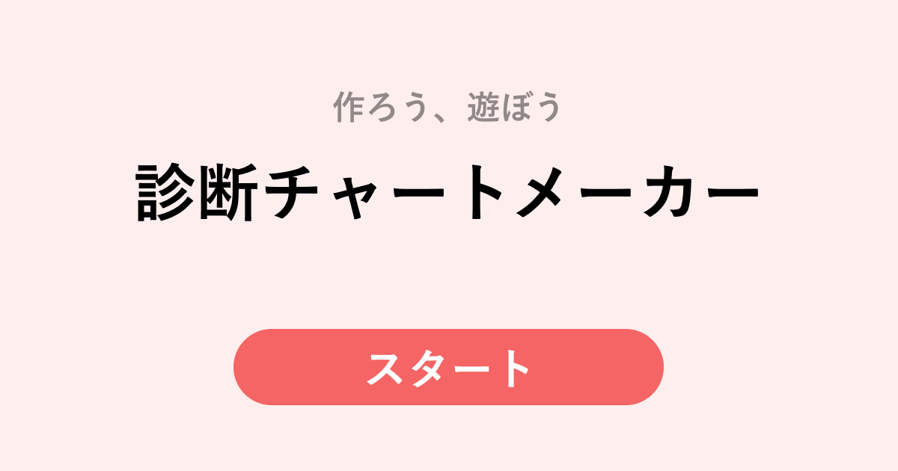

# 診断チャートメーカー



## 動的OGP画像のAPI 🌄
[retoruto\-carry/shindan\-chart\-maker\-ogp](https://github.com/retoruto-carry/shindan-chart-maker-ogp)

環境変数のOGP_API_URLにはこのAPIのエンドポイントを指定する

## Build Setup 🏗️
```bash
# install dependencies
$ yarn install

# serve with hot reload at localhost:3000
$ yarn dev

# build for production and launch server
$ yarn build
$ yarn start

# generate static project
$ yarn generate
```

For detailed explanation on how things work, check out [Nuxt.js docs](https://nuxtjs.org).

## 参考にしたコード 🙏

- [pokemon63/README\.md at master · potato4d/pokemon63](https://github.com/potato4d/pokemon63/blob/master/README.md)
  - Nuxt × Typescript × Firebaseの雛形として参考にした

- [Tree view from unordered list](https://codepen.io/ross-angus/pen/jwxMjL?__cf_chl_jschl_tk__=b500ef43c274ced69c7789135ae5f91dc41a5715-1592141349-0-AdPgBdhmtpDdcEolihJ21YSARcg6WRbMriSlAPjrWsPgVKYiQGxhxX-Q31P4zm0q6BkG4uM_54CeBVcs3L3khMq0QI1tf2BPou_eS8ZV12KQZd6O67IntsyyWPwit0lWQl78gUUYV62-lyo20r1MuDIKBos3M6Iu6xV8CZoeLFhzr7VHFMasY8VZ6sc3drm8fJFExMtPZ85KU6DaavBiOOrHpeqcNOZP47U2elfubZnNMt_pNa78AfEteY3yuBys63e1Rhm5_-yJ3zau5cO_y5gVdpFlL047KNPDbDp-kWOPzBFqp32WmTxi9HD6D5Xoin_rhnlyfahU7a3GxV4C56lVbDj5IZpDdOb7OMpuZDff)
  - フローチャートのCSSの参考にした